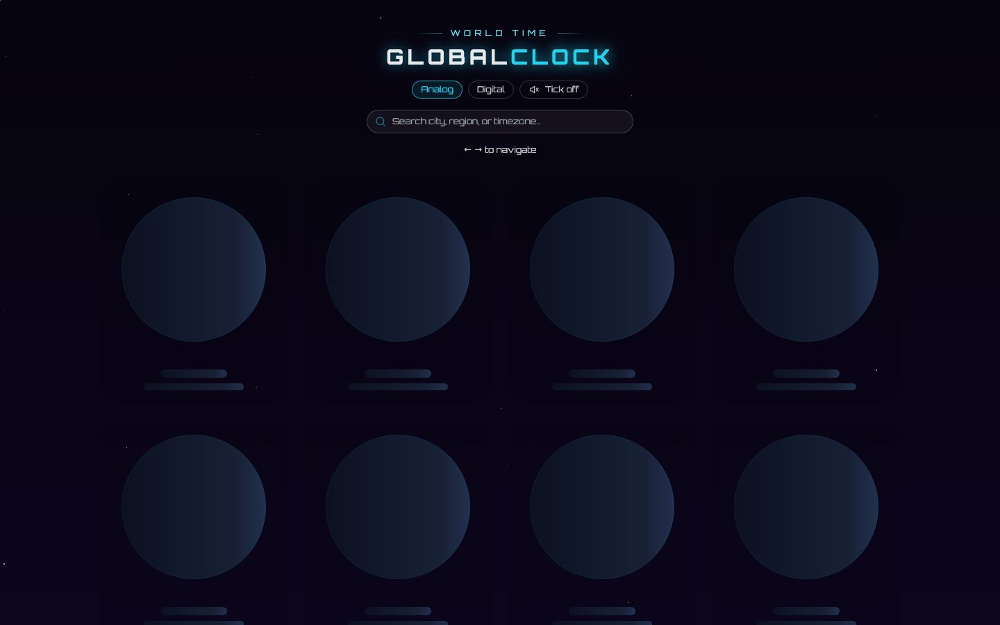

## GlobalClock

GlobalClock is a React world clock dashboard built with Vite and Tailwind CSS. It shows live analog or digital clocks for countries across multiple timezones, with search, drag-to-reorder, smooth transitions, and an optional ambient ticking sound.

<p align="center">
  
</p>

## Performance

| Metric | Score |
|---|---|
| Performance | 91 |
| Accessibility | 96 |
| Best Practices | 100 |
| SEO | 100 |

### Features

- Live timezone clocks powered by the browser `Date` and `Intl` APIs
- Analog and digital display modes
- Search by country, region, or timezone
- Drag-and-drop clock reordering with saved order in `localStorage`
- Smooth card transitions with Framer Motion
- Optional ticking sound toggle using Web Audio
- Midnight confetti celebration for each timezone
- Responsive grid layout
- Accessibility improvements including focus rings, ARIA labels, semantic landmarks, and higher contrast text
- SEO metadata and Open Graph tags
- Production bundle splitting for smaller deploy chunks

### Tech Stack

- React
- Vite
- Tailwind CSS
- `@dnd-kit` for sortable drag-and-drop
- Framer Motion for transitions
- Canvas Confetti for midnight effects

### Getting Started

Install dependencies:

```bash
npm install
```

Start the development server:

```bash
npm run dev
```

Build for production:

```bash
npm run build
```

Preview the production build:

```bash
npm run preview
```

### Data Source

The app does not call a backend or external time API. Timezone entries live in `src/Components/countriesArray.js`, and each clock is calculated locally with:

```js
new Date().toLocaleString("en-US", {
  timeZone: country.timezone,
});
```

This keeps the app fast, private, and usable without a server dependency. The displayed time depends on the user's device clock and the browser's built-in timezone database.

### Deployment

The app is ready for static hosting platforms such as Vercel. Use the default Vite settings:

- Build command: `npm run build`
- Output directory: `dist`

Vercel serves deployments over HTTPS automatically.
